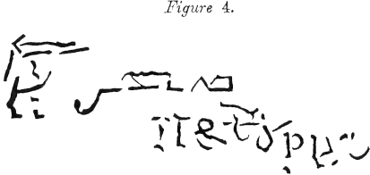

# "To be a programmer is not easy; <br />to be a full stack programmer is uneasy."

<br /><br />

[](https://www.eapoe.org/works/tales/pymb23.htm)


## Prologue
<span style="font-size: 36px; font-weight: bold;">A</span>ll of us have bad times, only few of us tackle with composure. We have been taught since early childhood, but those knowledge are stale and stinky and of little use. 

All of us have sad times, only few of us handle with decorum. We have made friends since early childhood, but those faces are withered and wrinkle and of little help. 

Life is compared to many stages, and so does [MERN](https://www.mongodb.com/mern-stack). Our development starts on backend first, once it's workable, we delve into frontend. And then to backend for authentication, then back to frontend again... To put it simple, we loop between backend and frontend until finished. 


## I. Backend
### Step 1. 
Backend API, per se, is a typical [express](https://www.npmjs.com/package/express) application, with models and routes of <code>User</code> and <code>Note</code> properly setted up. Full CRUD functions are implemented, everything was **UN**-protected yet. 


### Step 2. 
User authentication was implemented by means of [jwt](https://jwt.io/), more packages are involved. The main logic resides in <code>authController</code> which enforces security and issues <code>access token</code> and <code>refresh token</code> accordingly. 

middleware\verifyJWT.js
```javascript
const jwt = require('jsonwebtoken')

const verifyJWT = (req, res, next) => {
    const authHeader = req.headers.authorization || req.headers.Authorization

    if (!authHeader?.startsWith('Bearer ')) {
        return res.status(401).json({ message: 'Unauthorized' })
    }

    const token = authHeader.split(' ')[1]

    jwt.verify(
        token,
        process.env.ACCESS_TOKEN_SECRET,
        (err, decoded) => {
            if (err) return res.status(403).json({ message: 'Forbidden' })
            req.user = decoded.UserInfo.username
            req.roles = decoded.UserInfo.roles
            next()
        }
    )
}

module.exports = verifyJWT 
```

Security is a must! <code>User</code> and <code>Note</code> routes are protected thence. 


### Source tree 
```text
|   package.json
|   package-lock.json
|   UserStories.md
|   server.js
|   requests.rest
+---public
|   \---css
|           style.css
+---routes
|       root.js
|       userRoutes.js
|       noteRoutes.js
|       authRoutes.js
+---views
|       index.html
|       404.html
+---logs
|       reqLog.log
|       errLog.log
|       mongoErrLog.log
+---middleware
|       errorHandler.js
|       logger.js
|       loginLimiter.js
|       verifyJWT.js
+---img
|       cors.JPG
+---config
|       allowedOrigins.js
|       corsOptions.js
|       dbConn.js
+---models
|       Note.js
|       User.js
\---controllers
        usersController.js
        notesController.js
        authController.js
```


### .env 
```text 
NODE_ENV=development

DATABASE_URI=<your mongodb uri>

# node 
# require('crypto').randomBytes(64).toString('hex')
ACCESS_TOKEN_SECRET=<your asscess token>


REFRESH_TOKEN_SECRET=<your refresh token>
```


## II. Frontend
### Step 1. 
Frontend is a [React](https://reactjs.org/) [single page application](https://developer.mozilla.org/en-US/docs/Glossary/SPA). As I am a *newbie*, although endeavour to learn by watching online videos, still find it difficult in understand the way it was. With the same step of backend, the frontend was implemented with full CRUD by calling the backend API. 

Previously, the author introduced [Axios API](https://axios-http.com/) to replace pure javascript [fetch API](https://developer.mozilla.org/en-US/docs/Web/API/Fetch_API); [Easy Peasy](https://easy-peasy.vercel.app/) as a kind of [Store](https://learn.co/lessons/react-stores). This time [Dave](https://www.youtube.com/c/DaveGrayTeachesCode) introduced [Resux](https://redux.js.org/), which is over-powered in this application, i think. I am going to spend a couple of weeks to *catch up* Redux before I can give my opinion. 


### Step 2. 
Going further ahead, <code>Login</code> screen is added, more packages are involved. 


Many more complicated logic are needed in order to manage user states. I can't grasp without gasp, and for sure will repeat the video, i think. 


### Source tree 
```text
|   package.json
|   package-lock.json
|   README.md
|   UserStories.md                  
+---src
|   |   index.css
|   |   App.js
|   |   index.js
|   +---img
|   |       background.jpg
|   +---components
|   |       Layout.js
|   |       Public.js
|   |       DashLayout.js
|   |       DashHeader.js
|   |       DashFooter.js
|   +---features
|   |   +---auth
|   |   |       Login.js
|   |   |       Welcome.js
|   |   |       Prefetch.js
|   |   |       authSlice.js
|   |   |       authApiSlice.js
|   |   |       PersistLogin.js
|   |   |       RequireAuth.js
|   |   +---notes
|   |   |       NotesList.js
|   |   |       Note.js
|   |   |       notesApiSlice.js
|   |   |       EditNote.js
|   |   |       EditNoteForm.js
|   |   |       NewNote.js
|   |   |       NewNoteForm.js
|   |   \---users
|   |           UsersList.js
|   |           User.js
|   |           usersApiSlice.js
|   |           EditUser.js
|   |           EditUserForm.js
|   |           NewUserForm.js
|   +---app
|   |   |   store.js
|   |   \---api
|   |           apiSlice.js
|   +---config
|   |       roles.js
|   \---hooks
|           usePersist.js
|           useAuth.js
|           useTitle.js
+---public
|   |   index.html
|   |   favicon.ico
|   |   manifest.json
|   |   logo192.png
|   |   logo512.png
|   |   robots.txt
|   \---img
|           background.jpg
\---build
    |   favicon.ico
    |   manifest.json
    |   logo192.png
    |   logo512.png
    |   robots.txt
    |   index.html
    |   asset-manifest.json
    +---img
    |       background.jpg
    \---static
        +---js
        |       main.d254d50a.js
        |       main.d254d50a.js.map
        |       main.d254d50a.js.LICENSE.txt
        +---css
        |       main.afc46d7b.css.map
        |       main.afc46d7b.css
        \---media
                background.aecd42b4c1d197657b25.jpg
```


## III. Summary 
- Things get started small and tidy, but mess up unconceivably fast. A formidable monster of monolith ends up, usually.

- Man, however wise and nice, tends to be too confident in one's potency to neglect obstacles lay ahead. 


## IV. Reference
1. [MERN Stack Full Tutorial & Project | Complete All-in-One Course | 8 Hours](https://youtu.be/CvCiNeLnZ00)
2. [React JS Full Course for Beginners | Complete All-in-One Tutorial | 9 Hours](https://youtu.be/RVFAyFWO4go)
3. [React Router v6 in 20 Minutes | RRv6 Upgrade & Refactor Tutorial](https://youtu.be/XBRLVRjZ3CQ)
4. [React Redux Full Course for Beginners | Redux Toolkit Complete Tutorial](https://youtu.be/NqzdVN2tyvQ)
5. [Node.js Full Course for Beginners | Complete All-in-One Tutorial | 7 Hours](https://youtu.be/f2EqECiTBL8)
6. [JWT Authentication | Node JS and Express tutorials for Beginners](https://youtu.be/favjC6EKFgw)
7. [render.com](https://render.com/)
8. [The Narrative of Arthur Gordon Pym](https://www.eapoe.org/works/editions/pymbc.htm)


## Epilogue 
> The darkness had materially increased, relieved only by the glare of the water thrown back from the white curtain before us. Many gigantic and pallidly white birds flew continuously now from beyond the veil, and their scream was the eternal Tekeli-li! as they retreated from our vision. Hereupon Nu-Nu stirred in the bottom of the boat; but, upon touching him, we found his spirit departed. And now we rushed into the embraces of the cataract, where a chasm threw itself open to receive us. But there arose in our pathway a shrouded human figure, very far larger in its proportions than any dweller among men. And the hue of the skin of the figure was of the perfect whiteness of the snow.

> 天空越加變黑，眼前的白色簾幕些微反射着水面眩光，許多巨大的蒼白色飛鳥在簾幕上盤旋，它們的叫聲是永恆的特克里里，杳然而逝。此時，奴奴在船中微動；然而‧‧‧，觸摸他時，他已經魂不附體。與此同時，我們駛進了大瀑布的懷裏，一道裂縫敞開像是在迎接我們。前方路上柱立着披白色罩袍的人形，其體積遠大於人類中的任何生物，那人形物體膚色是完美的雪白。
<br />

[](https://www.eapoe.org/works/tales/pymb25.htm)


## EOF (2022/11/04)
