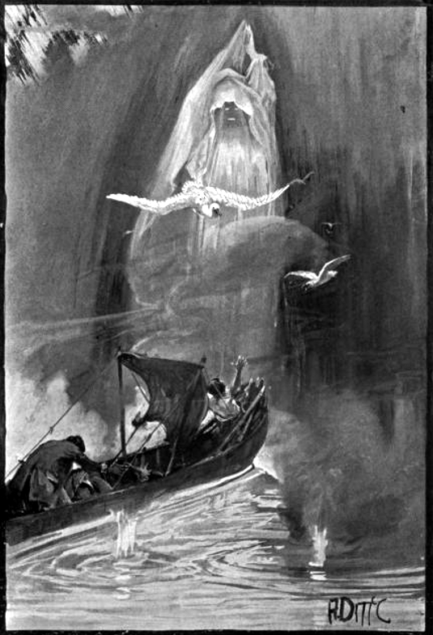

# "To be a programmer is not easy,  to be a full stack programmer is uneasy."

   

## Prologue
All of us have bad times, only few of us tackle with composure. We have been taught since early childhood, but those knowledge are stale and stinky and of little use. 

All of us have sad times, only few of us handle with decorum. We have made friends since early childhood, but those faces are withered and wrinkle and of little help. 

Life is compared to many stages, and so does [MERN](https://www.mongodb.com/mern-stack). Our development starts on backend first, once it's workable, we delve into frontend. And then to backend for authentication, then back to frontend again... To put it simple, we loop between backend and frontend until finished. 

## I. Backend

## II. Frontend

## III. Summary 
Things get started small and tidy, but mess up unconceivably fast. A formidable monster of monolith ends up, usually.

Man, however wise and nice, tends to be too confident in one's potency to neglect obstacles lay ahead. 

## IV. Reference
1. [MERN Stack Full Tutorial & Project | Complete All-in-One Course | 8 Hours](https://youtu.be/CvCiNeLnZ00)
2. [React JS Full Course for Beginners | Complete All-in-One Tutorial | 9 Hours](https://youtu.be/RVFAyFWO4go)
3. [React Router v6 in 20 Minutes | RRv6 Upgrade & Refactor Tutorial](https://youtu.be/XBRLVRjZ3CQ)
4. [React Redux Full Course for Beginners | Redux Toolkit Complete Tutorial](https://youtu.be/NqzdVN2tyvQ)
5. [Node.js Full Course for Beginners | Complete All-in-One Tutorial | 7 Hours](https://youtu.be/f2EqECiTBL8)
6. [JWT Authentication | Node JS and Express tutorials for Beginners](https://youtu.be/favjC6EKFgw)
7. [The Narrative of Arthur Gordon Pym](https://www.eapoe.org/works/editions/pymbc.htm)

## Epilogue 
> The darkness had materially increased, relieved only by the glare of the water thrown back from the white curtain before us. Many gigantic and pallidly white birds flew continuously now from beyond the veil, and their scream was the eternal Tekeli-li! as they retreated from our vision. Hereupon Nu-Nu stirred in the bottom of the boat; but, upon touching him, we found his spirit departed. And now we rushed into the embraces of the cataract, where a chasm threw itself open to receive us. But there arose in our pathway a shrouded human figure, very far larger in its proportions than any dweller among men. And the hue of the skin of the figure was of the perfect whiteness of the snow.

 

## EOF (2022/11/04)
